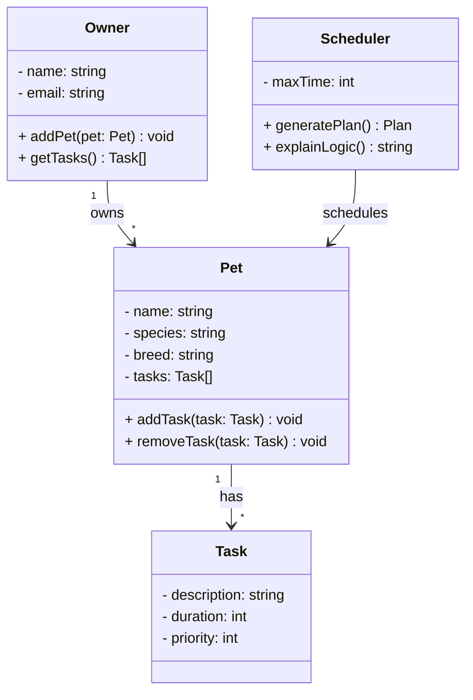

# PawPal+ System Design - Class Diagram

```mermaid
classDiagram
    class Owner {
        - name: string
        - email: string
        + addPet(pet: Pet) void
        + getTasks() Task[]
    }
    
    class Pet {
        - name: string
        - species: string
        - breed: string
        - tasks: Task[]
        + addTask(task: Task) void
        + removeTask(task: Task) void
    }
    
    class Task {
        - description: string
        - duration: int
        - priority: int
    }
    
    class Scheduler {
        - maxTime: int
        + generatePlan() Plan
        + explainLogic() string
    }
    
    Owner "1" --> "*" Pet : owns
    Pet "1" --> "*" Task : has
    Scheduler --> Pet : schedules
```
