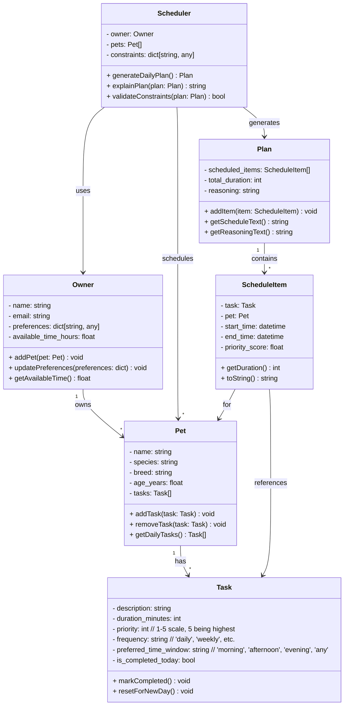

# PawPal Pet Care Assistant - System Design - Class Diagram

```mermaid
classDiagram
    class Owner {
        - name: string
        - email: string
        - preferences: dict[string, any]
        - available_time_hours: float
        + addPet(pet: Pet) void
        + updatePreferences(preferences: dict) void
        + getAvailableTime() float
    }

    class Pet {
        - name: string
        - species: string
        - breed: string
        - age_years: float
        - tasks: Task[]
        + addTask(task: Task) void
        + removeTask(task: Task) void
        + getDailyTasks() Task[]
    }

    class Task {
        - description: string
        - duration_minutes: int
        - priority: int  // 1-5 scale, 5 being highest
        - frequency: string  // 'daily', 'weekly', etc.
        - preferred_time_window: string  // 'morning', 'afternoon', 'evening', 'any'
        - is_completed_today: bool
        + markCompleted() void
        + resetForNewDay() void
    }

    class Scheduler {
        - owner: Owner
        - pets: Pet[]
        - constraints: dict[string, any]
        + generateDailyPlan() Plan
        + explainPlan(plan: Plan) string
        + validateConstraints(plan: Plan) bool
    }

    class Plan {
        - scheduled_items: ScheduleItem[]
        - total_duration: int
        - reasoning: string
        + addItem(item: ScheduleItem) void
        + getScheduleText() string
        + getReasoningText() string
    }

    class ScheduleItem {
        - task: Task
        - pet: Pet
        - start_time: datetime
        - end_time: datetime
        - priority_score: float
        + getDuration() int
        + toString() string
    }

    Owner "1" --> "*" Pet : owns
    Pet "1" --> "*" Task : has
    Scheduler --> Owner : uses
    Scheduler --> "*" Pet : schedules
    Scheduler --> Plan : generates
    Plan "1" --> "*" ScheduleItem : contains
    ScheduleItem --> Task : references
    ScheduleItem --> Pet : for
```
